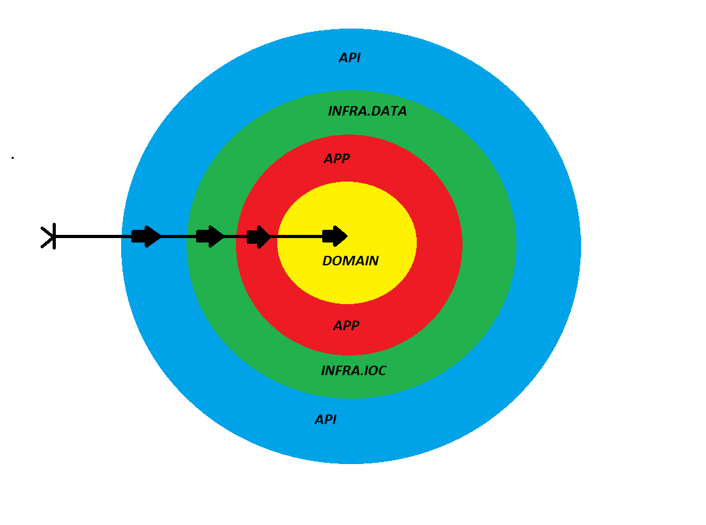

# Clean Architecture: Um Projeto de Estudo com Estruturação em Camadas e Independência de Dependências 🍃

##### Neste projeto de estudo, explorei a Clean Architecture (Arquitetura Limpa), adotando uma estrutura em camadas e respeitando rigorosamente as regras de dependência. A base dessa arquitetura é a camada de domínio (domain), que concentra todas as regras de negócio e validações. Para acessá-las em outros contextos, utilizei interfaces adaptadoras (application interfaces). Também implementei DTOs, serviços e adaptadores na camada de infraestrutura de dados (infra.data), que convertem as entidades de domínio em entidades do JPA para interagir com o banco de dados. 

##### As interfaces dos repositórios foram definidas na camada de repositorys, garantindo a abstração do acesso aos dados. Na camada de infraestrutura de IoC (Inversion of Control), concentrei toda a configuração do projeto, incluindo aspectos de segurança. Por fim, a camada de API abriga os controllers e o exception handler, permitindo a interação com o sistema.

##### Este projeto apresenta uma estrutura organizada e modular, promovendo a separação de preocupações e facilitando a manutenção e evolução do código. Ao seguir as diretrizes da Clean Architecture, você terá um projeto robusto e altamente adaptável às mudanças futuras.

#### Versões usadas no projeto
###### - java : 11
###### - Spring Boot : 2.7.4 🍃

===========================================================================

### Para rodar o projeto localmente, faça o seguinte:

#### Certifique-se de ter os seguintes pré-requisitos instalados:

* JDK 11 [Dowload JDK](https://www.oracle.com/java/technologies/downloads/#java11)
* Clone o repositório do projeto:
* Clone HTTPS: https://github.com/brunoonofre64/clean-architecture.git
* Abra o projeto em sua IDE favorita (por exemplo, IntelliJ IDEA, Eclipse)
* Certifique-se de que o JDK 11 esteja configurado como o JDK do projeto

#### Executando o projeto
* No diretório raiz do projeto, compile e construa o projeto usando o seguinte comando:

*****./mvnw clean install*****

* Após a conclusão bem-sucedida do comando acima, você pode executar o projeto usando o seguinte comando:

*****./mvnw spring-boot:run*****

* Isso iniciará o projeto Spring Boot e ele estará acessível localmente.

*****http://localhost:8080*****

* O projeto está configurado para usar o banco de dados H2 incorporado. Durante a execução, você pode acessar o console do H2 para visualizar e gerenciar o banco de dados.

URL do Console do H2: *****http://localhost:8080/h2-console*****


===========================================================================

### Camada domain

##### Isenta de depdências!

### Camada de application

DEPENDÊNCIAS  | REFERÊNCIA
------------ | ---------------
SPRING BOOT STARTER PARENT | [STARTER PARENT](https://mvnrepository.com/artifact/org.springframework.boot/spring-boot-starter-parent)
SPRING BOOT STARTER | [SPRING BOOT STARTER](https://mvnrepository.com/artifact/org.springframework.boot/spring-boot-starter)
CAMADA DE DOMAIN | [DOMAIN](https://github.com/brunoonofre64/clean-architecture/blob/master/clean-architecture/api/dependecies/domain.xml)

### Camada de infra.data

DEPENDÊNCIAS  | REFERÊNCIA
------------ | ---------------
SPRING BOOT STARTER PARENT | [STARTER PARENT](https://mvnrepository.com/artifact/org.springframework.boot/spring-boot-starter-parent)
SPRING DATA JPA | [JPA](https://mvnrepository.com/artifact/org.springframework.data/spring-data-jpa)
H2 DATABASE | [H2](https://mvnrepository.com/artifact/com.h2database/h2)
FLYWAY CORE | [FLYWAY CORE](https://mvnrepository.com/artifact/org.flywaydb/flyway-core)
FLYWAY MYSQL | [FLYWAY MYSQL](https://mvnrepository.com/artifact/org.flywaydb/flyway-mysql)
MYSQL | [MYSQL](https://mvnrepository.com/artifact/mysql/mysql-connector-java)
CAMADA DE DOMAIN | [DOMAIN](https://github.com/brunoonofre64/clean-architecture/blob/master/clean-architecture/api/dependecies/domain.xml)
CAMADA DE APP | [APP](https://github.com/brunoonofre64/clean-architecture/blob/master/clean-architecture/api/dependecies/app.xml)

### Camada de infra.ioc

DEPENDÊNCIAS  | REFERÊNCIA
------------ | ---------------
SPRING BOOT STARTER PARENT | [STARTER PARENT](https://mvnrepository.com/artifact/org.springframework.boot/spring-boot-starter-parent)
SPRING FOX BOOT STARTER | [SPRING FOX](https://mvnrepository.com/artifact/io.springfox/springfox-boot-starter)
SWAGGER UI | [SWAGGER UI](https://mvnrepository.com/artifact/io.springfox/springfox-swagger-ui)
SPRING WEB | [SPRING WEB](https://mvnrepository.com/artifact/org.springframework.boot/spring-boot-starter-web)
SPRING SECURITY| [SPRING SECURITY](https://mvnrepository.com/artifact/org.springframework.boot/spring-boot-starter-security)
JAVA JWT | [JAVA JWT](https://mvnrepository.com/artifact/com.auth0/java-jwt)
CAMADA DE DOMAIN | [DOMAIN](https://github.com/brunoonofre64/clean-architecture/blob/master/clean-architecture/api/dependecies/domain.xml)
CAMADA DE APP | [APP](https://github.com/brunoonofre64/clean-architecture/blob/master/clean-architecture/api/dependecies/app.xml)
CAMADA DE INFRA.DATA | [INFRA.DATA](https://github.com/brunoonofre64/clean-architecture/blob/master/clean-architecture/api/dependecies/infra.data.xml)

### Camada de api

DEPENDÊNCIAS  | REFERÊNCIA
------------ | ---------------
SPRING BOOT STARTER PARENT | [STARTER PARENT](https://mvnrepository.com/artifact/org.springframework.boot/spring-boot-starter-parent)
SPRING WEB | [SPRING WEB](https://mvnrepository.com/artifact/org.springframework.boot/spring-boot-starter-web)
SPRING DEV TOOLS | [SPRING DEV TOOLS](https://mvnrepository.com/artifact/org.springframework.boot/spring-boot-devtools)


===========================================================================


````mermaid
---
title: Diagrama ER
---

erDiagram
    TB_CATEGORY ||--|{ TB_PRODUCT : has
    TB_USER ||--|{ TB_USER_ROLES : user_id

TB_CATEGORY {
        UUID VARCHAR(36) PK
        name VARCHAR(255)
    }

TB_PRODUCT {
        UUID VARCHAR(36) PK
        name VARCHAR(255)
        description VARCHAR(255)
        price DOUBLE
        stock INT
        image VARCHAR(255)
        category_uuid VARCHAR(255)
        TB_CATEGORY_UUID VARCHAR(36) FK
    }

TB_USER {
        UUID VARCHAR(36) PK
        username VARCHAR(255)
        password VARCHAR(255)
    }

TB_USER_ROLES {
        user_id VARCHAR(36) FK
        ROLES VARCHAR(36)
        TB_USER_UUID VARCHAR(36) FK
    }
    

````

===========================================================================


### Regra de depêndencia deste projeto usando Clean Archtecture




===========================================================================

### Contratos e endpoints para consumo da API localmente ou de produção usando interface do swagger - OpenAPI.

* *****LOCAL*****
* *****http://localhost:8080/swagger-ui/index.html*****

#### A API está protegida por autenticação e autorização via JWT, que tenha autorização de realizar operações de entrada de dados, é necessário que usando o postman, você no endpoint ***/login*** envie um método POST, onde selecionando o ***Body*** e a opção ***x-www-form-urlencoded*** você insira ***email*** e ***senha*** de acesso, como mostra o exemplo abaixo:


Key  | Value
------------ | ---------------
username | guest
password | guest

#### Agora use o ***access_token*** gerado para acessar via ***Bearer*** ***Token.***


